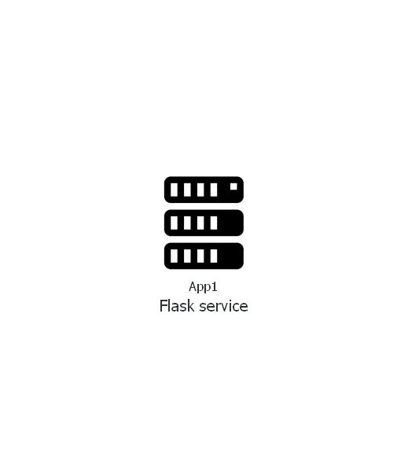

# SRE Principles - demo project

This is a demo project to practice IaC concepts and devops tools for service documenting

Code in this repo deploys a python application (Flask Sqllite3 todo CRUD [^1]) to the local platform using Vagrant
<br>
[^1]: CRUD - Create Read Update Delete


## Installation

Vagrant manifest doesn't contain any platform specific properties and supposed to run on any system. It has been tested only on Windows 10 Pro with Hyper-V hypervisor, though.

```powershell
#install vagrant via chocolaty or download msi installer 
choco install vagrant

#Enable Hyper-V feature
Enable-WindowsOptionalFeature -Online -FeatureName Microsoft-Hyper-V -A
```

## Usage

```powershell
# clone this repo into the local directory
git clone https://github.com/alextitov1/otus_labs

# change directory to ./vagrant
cd ./otus_labs/vagrant

# deploy vagrant environment 
vagrant up # if the deploy is complete successfully you will get a link to the service

# in order to destroy vagrant environment 
vagrant destroy

```

## Contributing
Pull requests are welcome. For major changes, please open an issue first to discuss what you would like to change.

Please make sure to update tests as appropriate.

## Service diagram
 

## Checklist
### Lab from Lecture 2 "SRE Basic Principles"

#### Tasks:
 - [x] create repository on github
 - [x] make a markdown Readme file [link](https://www.makeareadme.com/)
    - project short description
    - how to add a code
    - how to deploy the application
 - [x] make an application [diagram](https://github.com/mingrammer/diagrams)
 - [x] create Vagrant local environment
 - [x] make a deployment for the [application](https://github.com/Zenahr/flask-sqlite3-todo-crud)
 - [x] using Mkdocs create documentation for the project 

## License
[MIT](https://choosealicense.com/licenses/mit/)